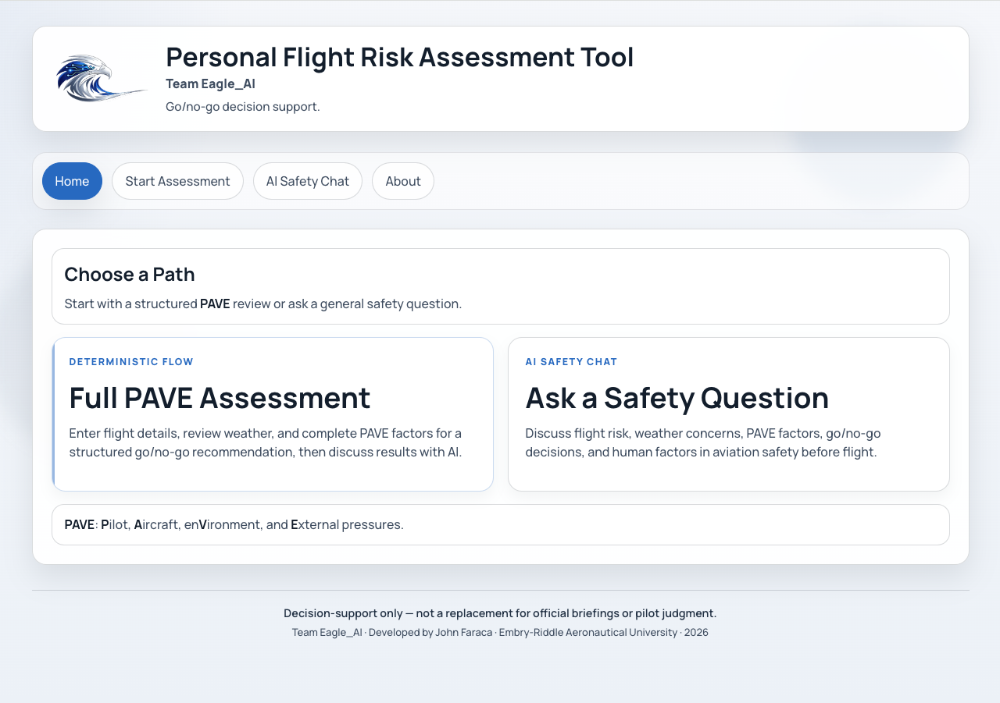
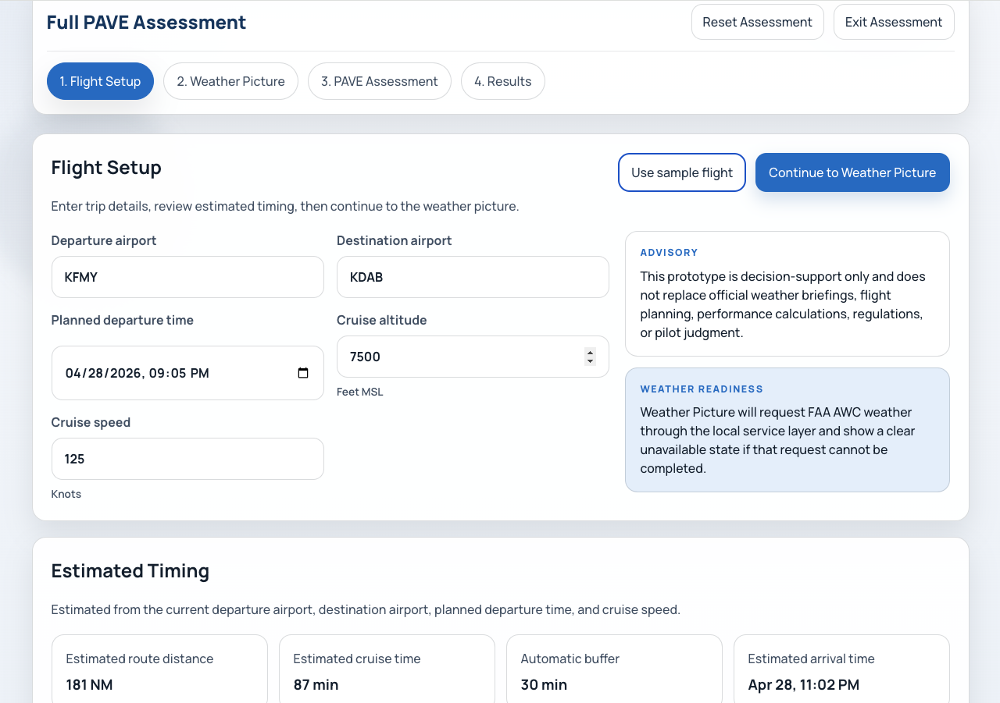
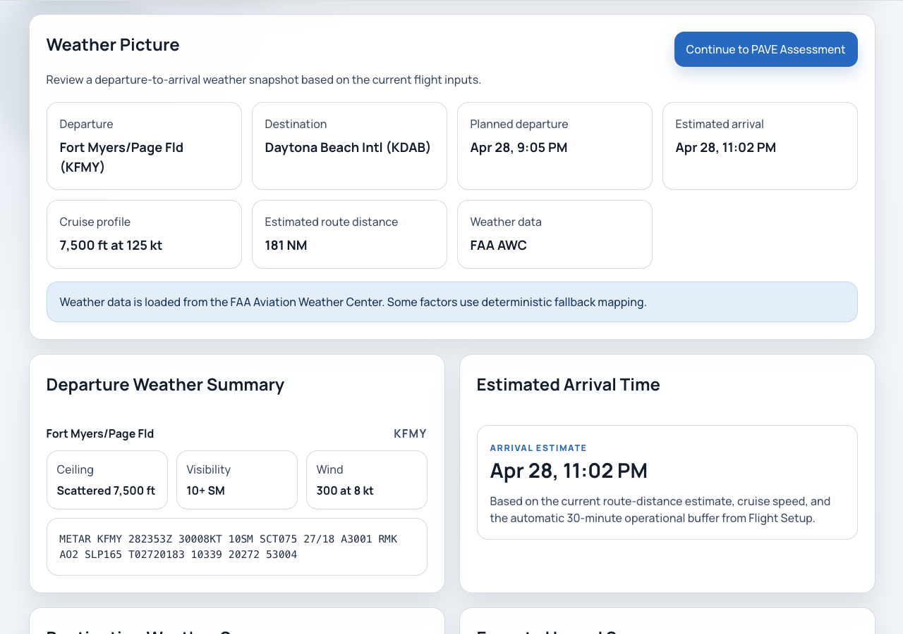
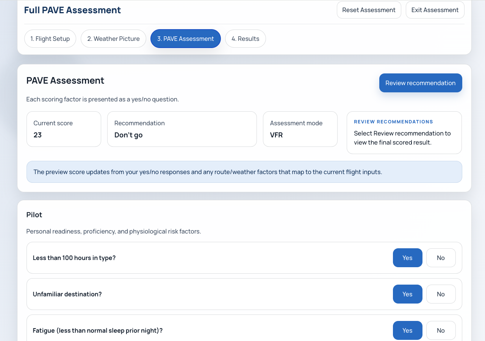
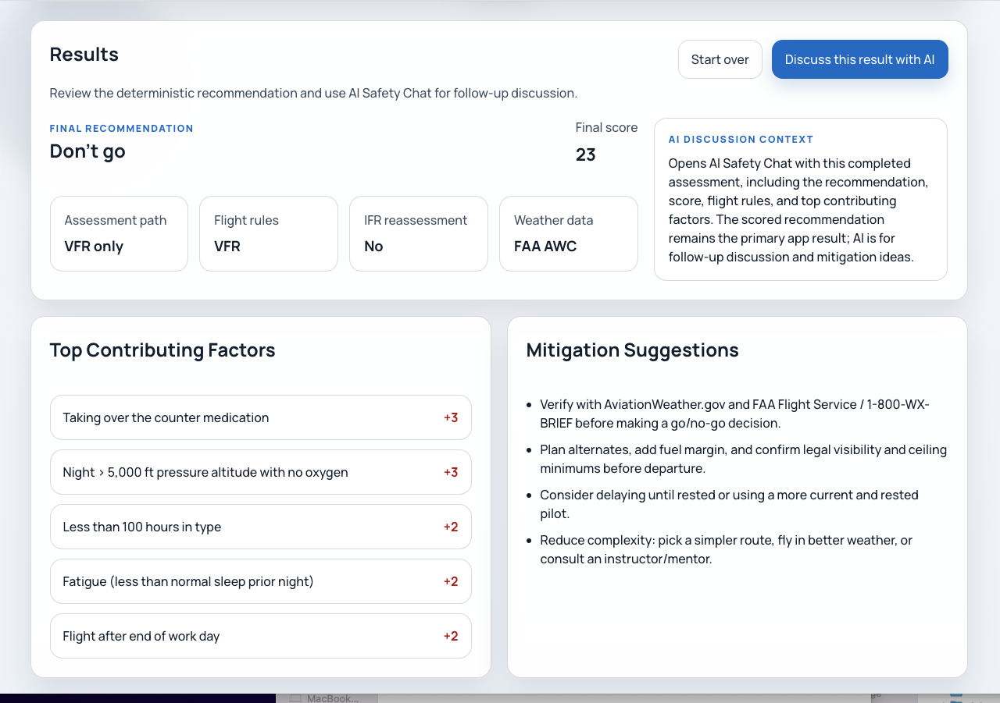
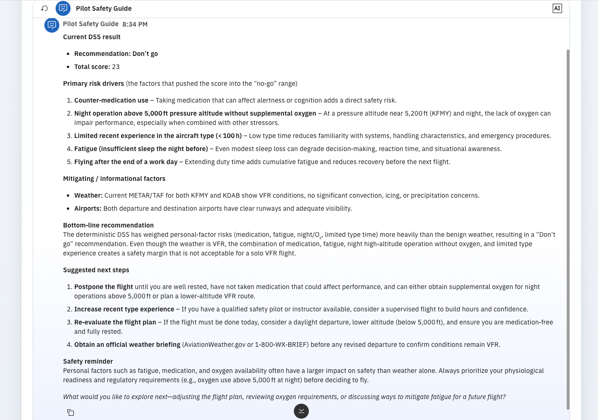

# Personal Flight Risk Assessment Tool
## Go/No-Go Decision Support

An educational MVP and decision-support prototype for structured preflight risk review. The app helps a pilot organize flight risk factors before departure by walking through flight setup, weather context, PAVE factors, deterministic scoring, advisories, and optional AI-supported discussion.

This project was developed for the **IBM SkillsBuild AI Experiential Learning Lab** by **Team Eagle_AI**.

**Core design principle:** deterministic scoring first; AI-supported discussion second.

The AI chat is supplemental. It does not calculate, override, authorize, or replace the final recommendation.

## Live Demo

**Prototype:** https://pave.johnfaraca.com  
**Demo Video:** https://youtu.be/SAOF7Vg5XpU  
**GitHub:** https://github.com/johnfaraca/personal-flight-risk-assessment-tool

## Problem Addressed

Pilots need structured support for organizing preflight risk factors before making operational decisions. Weather, aircraft limitations, pilot readiness, airport conditions, route complexity, and external pressures are often reviewed across separate sources. This can make the decision process fragmented, especially when multiple moderate risks combine into a larger safety concern.

The Personal Flight Risk Assessment Tool addresses this by guiding the user through a structured PAVE-based review and producing a consistent deterministic recommendation. The goal is not to replace pilot judgment, official weather briefings, flight planning, regulations, or instructor guidance. Instead, the prototype supports a more organized and transparent preflight decision-support process.

## How It Works

1. **Landing Page** — introduces the assessment flow and provides access to the general AI Safety Chat.
2. **Flight Setup** — collects route, timing, altitude, and cruise speed inputs.
3. **Weather Picture** — summarizes weather, airport, route, and advisory context.
4. **PAVE Assessment** — presents structured risk questions and pre-filled weather or airport factors where available.
5. **Results** — displays the deterministic recommendation, score details, flight rules applied, top risk drivers, and mitigation prompts.
6. **Discuss This Result with AI** — opens an IBM watsonx Orchestrate chat with assessment context for supplemental discussion.
7. **General AI Safety Chat** — provides a separate aviation safety discussion mode without requiring a completed assessment.

## What Is PAVE?

PAVE is an aviation risk-management framework:

- **Pilot**
- **Aircraft**
- **enVironment**
- **External pressures**

The app uses PAVE to structure the assessment flow and help users review human, aircraft, environmental, and pressure-related factors before interpreting the final result.

## Screenshots

### Landing Page


### Flight Setup


### Weather Picture


### PAVE Assessment


### Results Page


### AI Result Discussion


## Responsible AI Design

The recommendation is produced by deterministic scoring logic. AI is used only to help discuss completed results, risk drivers, and mitigation ideas.

AI does not calculate scores, override deterministic outcomes, authorize flight decisions, or make go/no-go decisions. The app also separates general AI Safety Chat from result-specific AI discussion so broad aviation questions and assessment-context discussion remain distinct experiences.

This creates a clearer human-AI workflow:

```text
Structured assessment
→ Deterministic score
→ Top contributing factors
→ Grounded AI discussion
```

## IBM watsonx Orchestrate Integration

IBM watsonx Orchestrate powers the embedded AI discussion layer. After the app generates a deterministic result, the assessment context is passed into the chat experience so the user can ask focused follow-up questions.

The assistant can receive structured context such as:

- Assessment mode
- Recommendation
- Total score
- Flight rules applied
- Top contributing factors

This helps keep the AI discussion grounded in the actual assessment instead of producing generic or wandering advice. The behavior and guideline controls in watsonx Orchestrate helped shape the assistant around the project’s safety-focused workflow.

## Weather and Advisory Note

The app uses FAA Aviation Weather Center data where available, including server-side requests for aviation weather products. Some advisories may be shown as advisory-only when they do not cleanly map to scored risk factors. NOTAM parsing may be unavailable depending on the data returned by FAA NOTAM Search.

Users must verify official weather, NOTAMs, and flight conditions separately through approved aviation sources before making operational decisions.

## Privacy Note

This prototype does not include user accounts, payment processing, or intentional collection or storage of personally identifiable information. Browser session storage may temporarily hold current assessment data so the result-specific AI discussion can receive the active assessment context during the session.

Embedded AI chat may process user messages and assessment context through IBM watsonx Orchestrate. Users should not enter sensitive personal, credential, medical, or private aircraft ownership information.

## Tech Stack

- React
- Vite
- React Router
- React Icons
- Node.js HTTP server for local app serving and API routes
- Server API routes for airport lookup, weather picture generation, and AI explanation availability
- FAA Aviation Weather Center data integration for METAR, TAF, station, airport, G-AIRMET, and SIGMET/AIRMET data
- FAA NOTAM Search integration with best-effort parsing
- IBM watsonx Orchestrate embedded chat
- Browser session storage for temporary assessment discussion context
- OpenAI Codex for AI-assisted development support

## Development Support

OpenAI Codex was used as an AI-assisted development tool during implementation. It supported React component updates, routing changes, scoring logic refinement, UI copy improvements, responsive design fixes, and troubleshooting.

Codex was used during development; IBM watsonx Orchestrate powers the user-facing embedded AI discussion experience.

## Project Flow

```text
Landing Page
→ Flight Setup
→ Weather Picture
→ PAVE Assessment
→ Results
→ Discuss Result with AI
```

## Setup and Run

Install dependencies:

```bash
npm install
```

Start the development server:

```bash
npm run dev
```

Build for production:

```bash
npm run build
```

Preview the production build through the Node server:

```bash
npm run preview
```

The local server defaults to `http://localhost:5173` unless `PORT` is set.

## Roadmap

Future development may include:

### Near-Term

- Optional pilot readiness self-check
- Aircraft profile inputs for user-entered POH/AFM values
- FAA airport/runway data integration for runway surface, VGSI/PAPI/VASI, weather reporting, and tower/service data

### Next Phase

- Crosswind vs. POH calculation
- NOTAM/TFR/MOA awareness
- Improved runway-condition and advisory mapping
- Saved pilot and aircraft profiles with personal minimums

### Advanced Phase

- Enroute weather corridor forecasting
- Alternate airport evaluation
- Terrain, over-water, approach availability, and radar/ATC detection
- Travel contingency support after delay or diversion

## Disclaimer

This prototype is for educational decision-support purposes only. It does not replace official weather briefings, FAA resources, instructor guidance, aircraft manuals, operational procedures, applicable regulations, or pilot-in-command authority and responsibility.

Pilots should verify all information through official sources, including AviationWeather.gov, FAA Flight Service, NOTAMs, Chart Supplements, aircraft POH/AFM materials, and applicable regulations before making any flight decision.

## Author

**John Faraca**  
Team Eagle_AI  
Embry-Riddle Aeronautical University  

LinkedIn: https://www.linkedin.com/in/john-faraca/  
GitHub: https://github.com/johnfaraca  
Project Repository: https://github.com/johnfaraca/personal-flight-risk-assessment-tool

## License

This project is licensed under the MIT License. See the LICENSE file for details.
